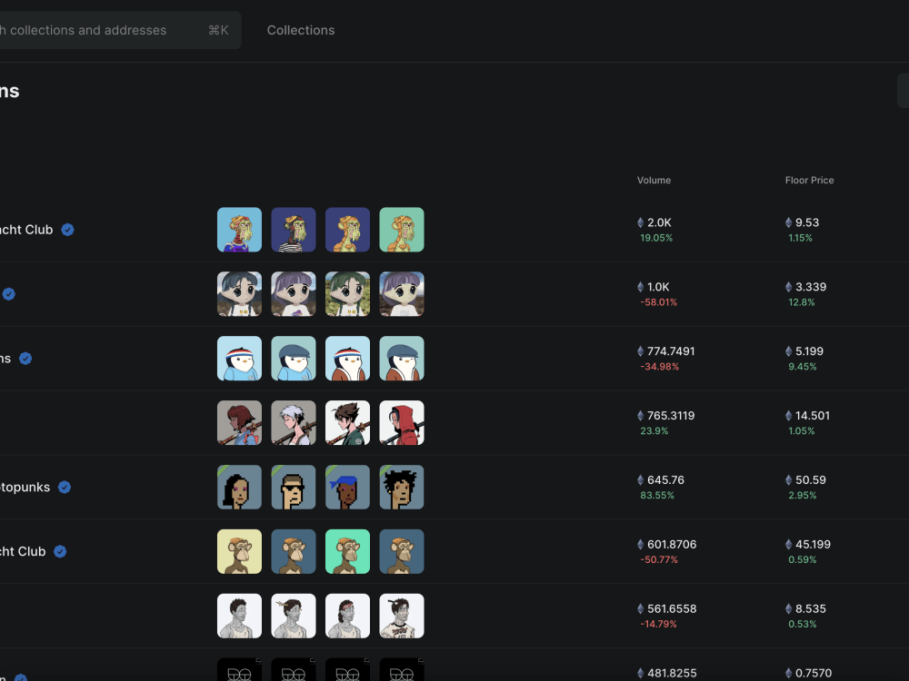
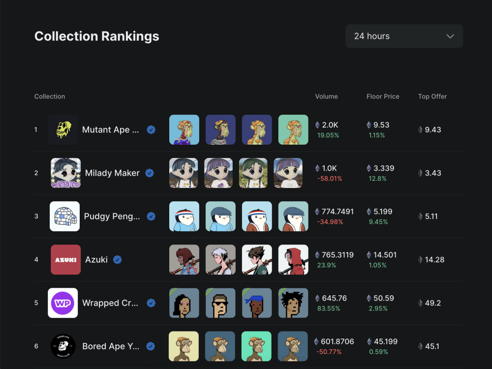
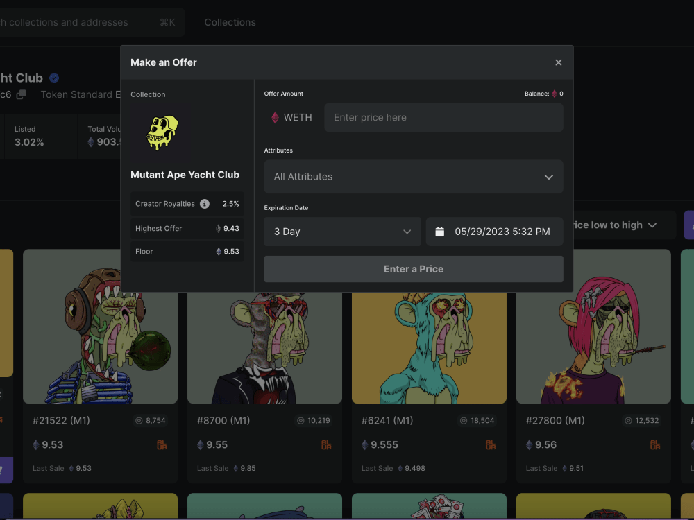
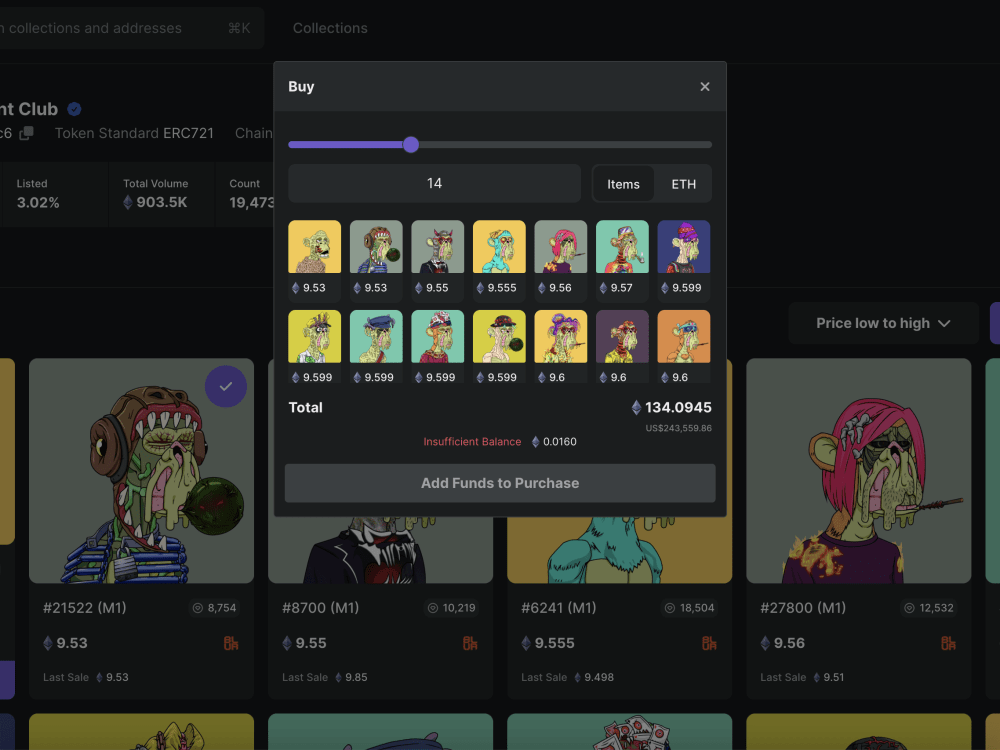
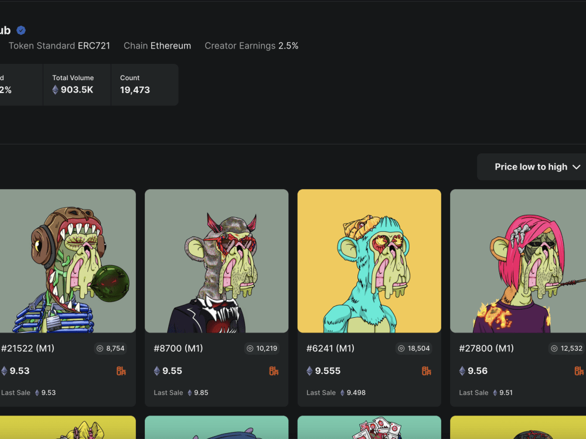
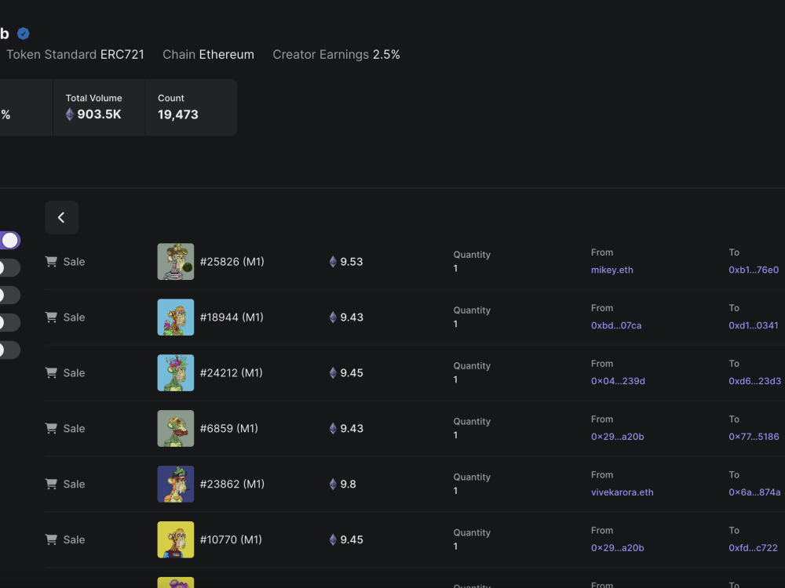
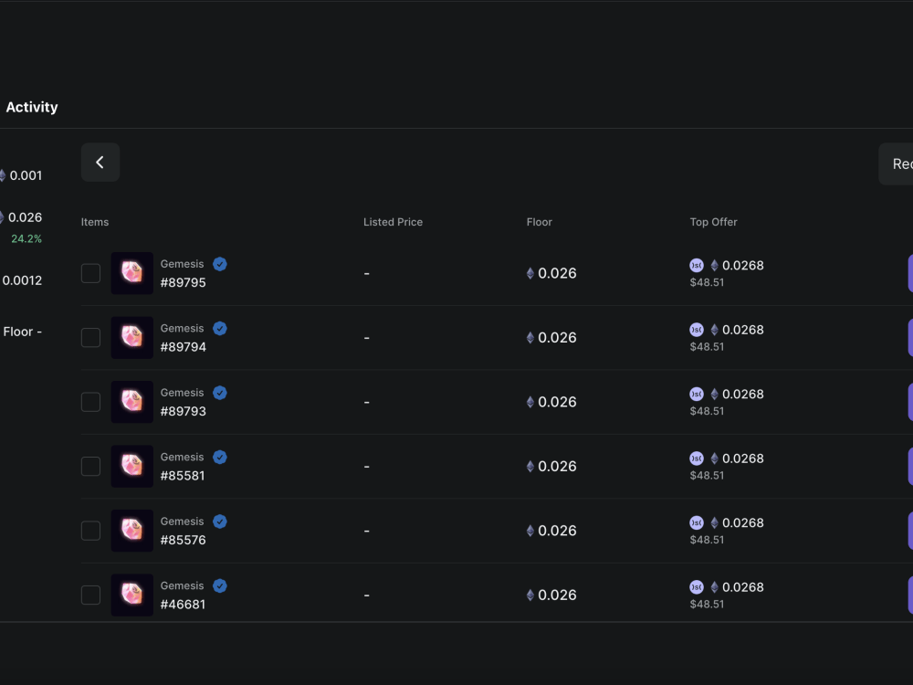
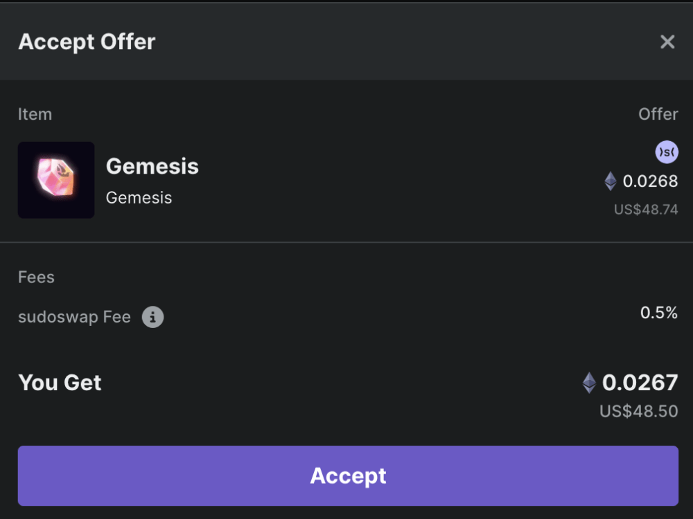
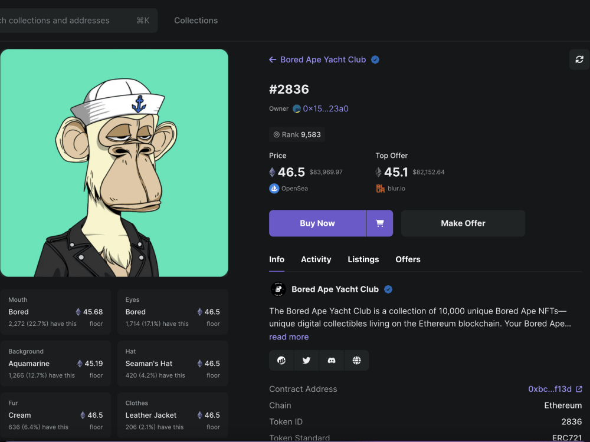

## Multichain NFT Marketplace
A unified platform that consolidates leading NFT marketplaces (e.g., Blur, OpenSea) into a single experience. It brings together aggregated listings, cross-chain transactions, and collection activity in one place, supporting end-to-end flows including buy, sell, sweep, and collection offers—backed by unified analytics and streamlined workflows.

### Key features
- Multichain integration: trade seamlessly across supported blockchain networks
- Aggregated listings: unified discovery across marketplaces with up-to-date pricing
- Secure transaction facilitation: consistent, transparent flows for buy/sell/sweep/offers
- Collection management: portfolio views, activity tracking, and performance insights
- Comprehensive analytics: market data and signals to inform pricing and decisions

### Product preview

<video src="src/main.mp4" controls width="800" muted playsinline>
  Your browser does not support the video tag.
</video>

  
  

  
  

  
  

  
  

  
  

---

### Contacts

| Platform | Link |
|----------|------|
| 📱 Telegram | [t.me/novustch](https://t.me/novustch) |
| 📲 WhatsApp | [wa.me/14105015750](https://wa.me/14105015750) |
| 💬 Discord | [discordapp.com/users/985432160498491473](https://discordapp.com/users/985432160498491473)

    
    
    

Feel free to reach out for implementation assistance or integration support.
